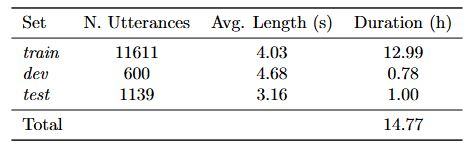
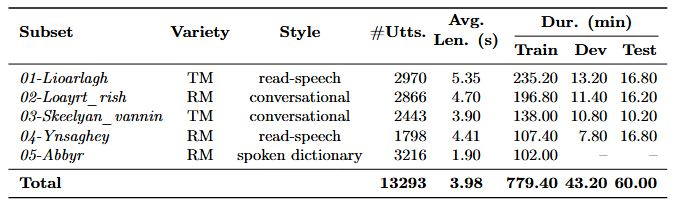

# Loayr: The First Segmented Speech Transcription Dataset for the Manx Language

Loayr is a dataset of Manx Gaelic speech recordings, transcriptions, and, where available, English translations. It is designed to support research and development in Manx language technologies.

## Subsets

Loayr-v2 contains approximately 15 hours of aligned speech-text data, organised into three subsets:

1. **train**  
   - **Description:** Automatically segmented short utterances (3–5 seconds). May contain segmentation errors.

2. **dev**  
   - **Description:** A smaller development set of automatically segmented short utterances (3–5 seconds). May contain segmentation errors.

3. **test**  
   - **Description:** A one-hour evaluation set manually segmented to ensure high-quality alignments. Designed for testing and benchmarking.

  

## Source and Domain Coverage

The dataset draws from five distinct sources—**Lioarlagh**, **Loayrt Rish**, **Skeealyn Vannin**, **Ynsaghey**, and **Abbyr**—which span a range of domains including read-speech, interviews, spoken dictionaries, instructional content, and archival recordings. These sources reflect both **Revived** and **Traditional** varieties of Manx.

A majority of the data is transcribed in Manx, with English translations available for many files, particularly in conversational and instructional sets. Quality varies by source: most are clean and high-quality, while older archival recordings may feature speaker overlap, noise, or mixed-language content.

   

## Licensing and Metadata

See `recordings_metadata.csv` for file-level details. All material is sourced from publicly available content. We aim to respect all original rights and licensing agreements.

## Accessing the Data

Transcripts and metadata are available in this repository. Due to file size, audio is not hosted here. Please contact the maintainer for access:

📧 **csjbartley1@sheffield.ac.uk**

## Contributions Welcome

Areas where contributions would be particularly valuable:

- **Additional Manx recordings** (labelled or unlabelled)
- **Corrections** to transcripts or metadata
- **Benchmarking**: Share results using this dataset

Feel free to open a pull request or contact the maintainer to collaborate.
